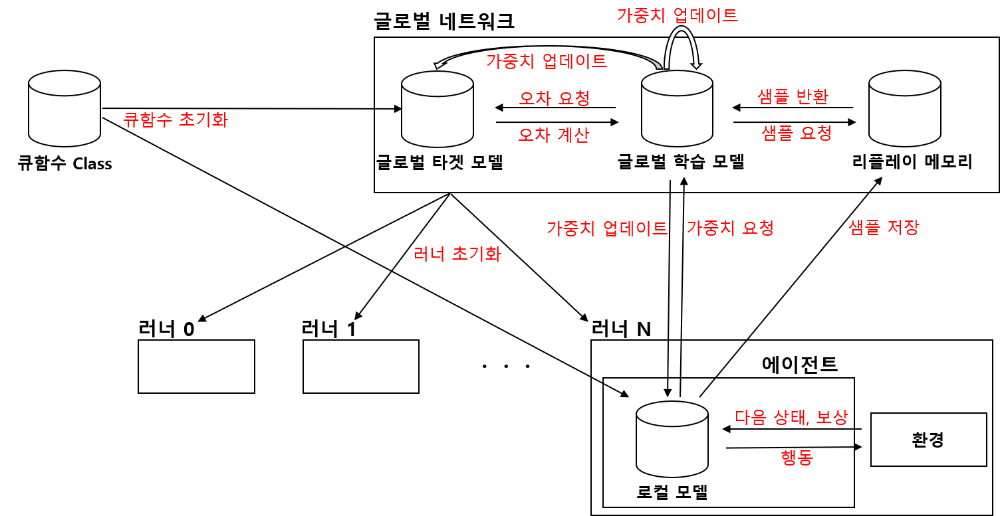

# Improved-DQN-experiments

### 1. v0.1-DQN model.html

- https://kihyeon-hong.github.io/Improved_DQN_experiments/DQNAnalysisHTMLCode/1.%20v0.1-DQN%20model.html

### 2. existingDQN model.html

- https://kihyeon-hong.github.io/Improved_DQN_experiments/DQNAnalysisHTMLCode/2.%20existingDQN%20model.html

### 3. v0.2-existingDQN model.html

- https://kihyeon-hong.github.io/Improved_DQN_experiments/DQNAnalysisHTMLCode/3.%20v0.2-existingDQN%20model.html

### 4. v0.3-DQM model.html

- https://kihyeon-hong.github.io/Improved_DQN_experiments/DQNAnalysisHTMLCode/4.%20v0.3-DQM%20model.html

### 5. v1.0-DQN model.html

- https://kihyeon-hong.github.io/Improved_DQN_experiments/DQNAnalysisHTMLCode/5.%20v1.0-DQN%20model.html

### 6. TwoTreadDQN model.html

- https://kihyeon-hong.github.io/Improved_DQN_experiments/DQNAnalysisHTMLCode/6.%20TwoTreadDQN%20model.html

- DQN model Analysis.html: https://kihyeon-hong.github.io/Improved_DQN_experiments/DQNAnalysisHTMLCode/DQN%20model%20Analysis.html

## Model

## 기존 DQN의 단점

- 리플레이 메모리를 사용함으로써 부하가 발생
- 과거의 데이터를 학습에 이용함

## 제안한 DQN

- 학습과정과 행동과정을 분리하고, Global Network에서는 리플레이 메모리를 이용한 학습, 쓰레드에서는 행동만 수행함으로써 부하를 줄임
- 매우 많은 쓰레드가 행동을 수행하고 리플레이 메모리의 샘플을 수집함으로써 과거의 데이터를 학습에 이용한다는 단점을 개선

## 결과

- 왼쪽은 행동을 수행하는 쓰레드를 1로 한 모델의 학습 에피소드 수와 큐함수의 그래프이며, 기존의 모델과 비슷한 학습률을 보였고, 학습과 행동을 분리함으로써 부하를 줄였기 때문에 하나의 에피소드를 수행하는 시간이 단축함
- 오른쪽은 행동을 수행하는 쓰레드를 2로 한 모델의 학습 에피소드 수와 큐함수의 그래프이며, 기존의 모델에 비해 더욱 빠른 학습 시작과 학습률을 보였음
- 이를 통하여 제안한 모델이 효과가 있음을 증명함
